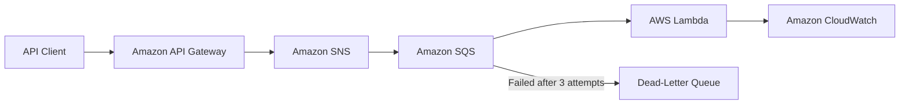
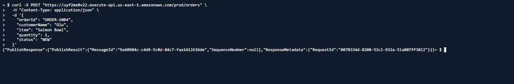
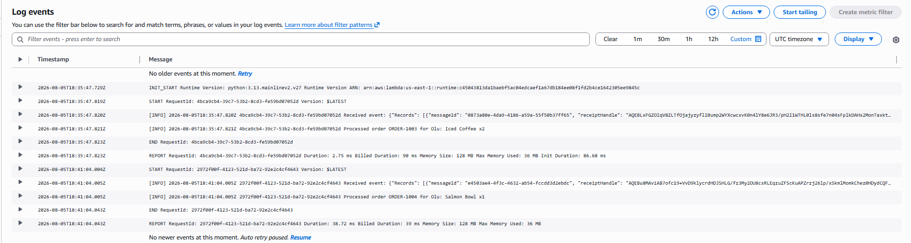
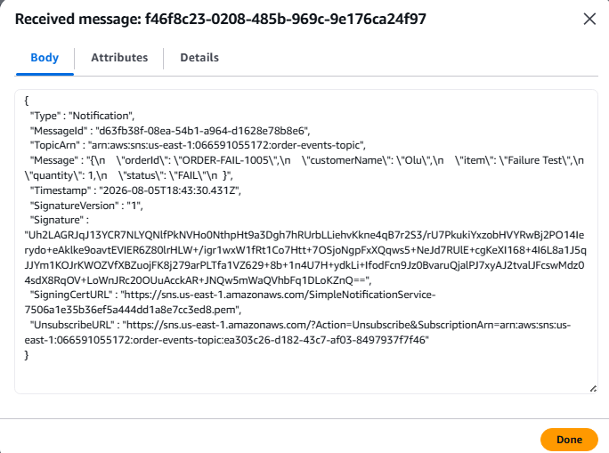
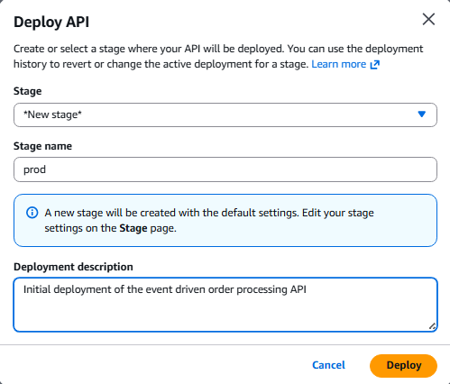
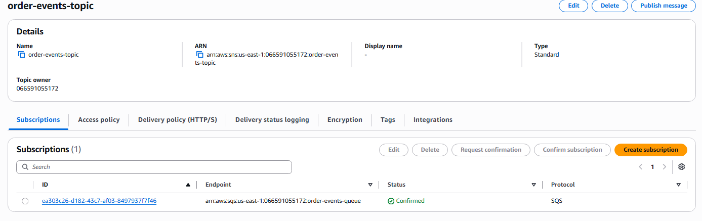
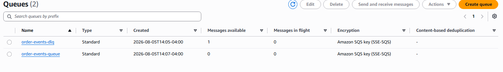
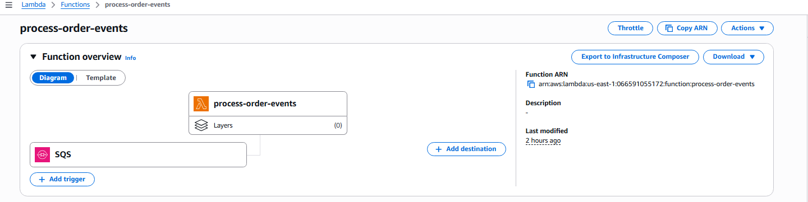
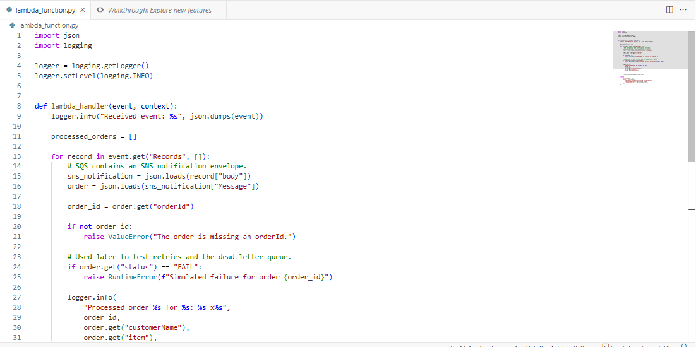

# AWS Event-Driven Order Processing Application

## Project Overview

This project demonstrates a serverless, event-driven order-processing application on AWS. A REST API accepts order requests and publishes them to an Amazon SNS topic. SNS forwards each event to an Amazon SQS queue, and AWS Lambda processes the order asynchronously.

Messages that repeatedly fail processing are moved to a dead-letter queue for troubleshooting and recovery.

## Architecture

## AWS Services Used

- Amazon API Gateway
- Amazon Simple Notification Service (SNS)
- Amazon Simple Queue Service (SQS)
- AWS Lambda
- Amazon CloudWatch
- AWS Identity and Access Management (IAM)

## Application Workflow

1. A client submits a JSON order to the `POST /orders` API endpoint.
2. API Gateway transforms the request and publishes it to Amazon SNS.
3. SNS delivers the event to the main SQS queue.
4. SQS stores the message until Lambda is available to process it.
5. Lambda validates and processes the order.
6. CloudWatch records execution and error logs.
7. After three failed processing attempts, SQS moves the message to the dead-letter queue.

## Key Features

- Asynchronous and loosely coupled architecture
- Reliable message buffering through Amazon SQS
- Publish-and-subscribe messaging through Amazon SNS
- Automatic Lambda invocation
- CloudWatch monitoring and logging
- Dead-letter queue for failed messages
- Least-privilege IAM permission for API Gateway
- Server-side SQS encryption
- TLS 1.3 API security policy

## Successful API Test

The deployed API accepted an order request and returned an SNS `PublishResponse` with a unique message ID.

## Successful Lambda Processing

CloudWatch confirmed that Lambda processed the submitted order successfully.

## Failure and Dead-Letter Queue Test

A test order with a status of `FAIL` deliberately triggered a Lambda error. After three unsuccessful processing attempts, SQS moved the message to the dead-letter queue.

## Additional Screenshots

### API Gateway Resource

### SNS-to-SQS Subscription

### SQS Queues

### Lambda Trigger Architecture

### Lambda Code

### Production API Stage

## Skills Demonstrated

- Designing serverless event-driven systems
- Creating REST API endpoints
- Integrating API Gateway directly with AWS services
- Configuring SNS and SQS messaging
- Implementing Lambda event processing with Python
- Applying IAM least-privilege permissions
- Configuring retry behavior and dead-letter queues
- Testing APIs with cURL
- Monitoring applications with CloudWatch
- Troubleshooting AWS request transformations and permissions

## Project Files

- `lambda_function.py` — Lambda order-processing code
- `screenshots/` — AWS configuration and testing evidence

## Cleanup

The deployed AWS resources were removed after testing and documentation to prevent unnecessary charges.
